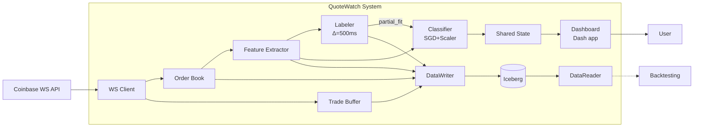
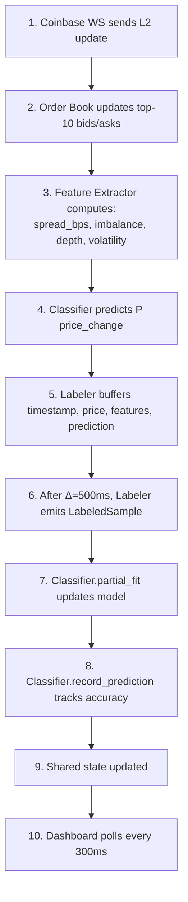
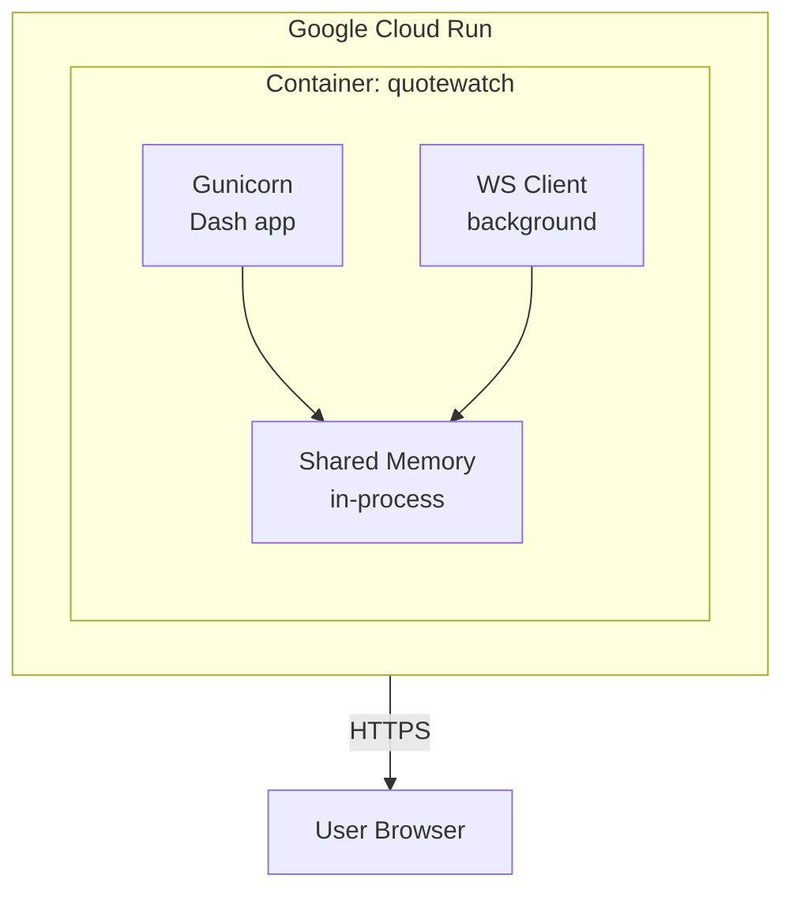
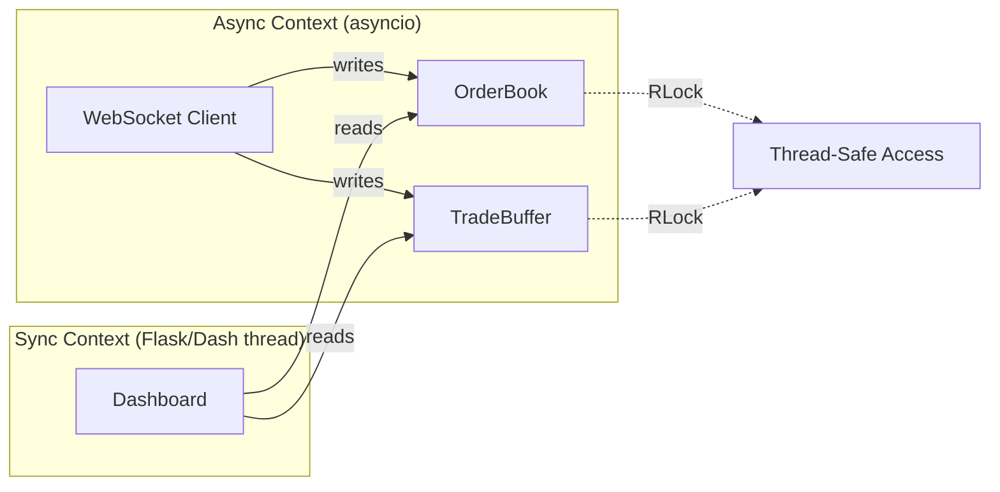
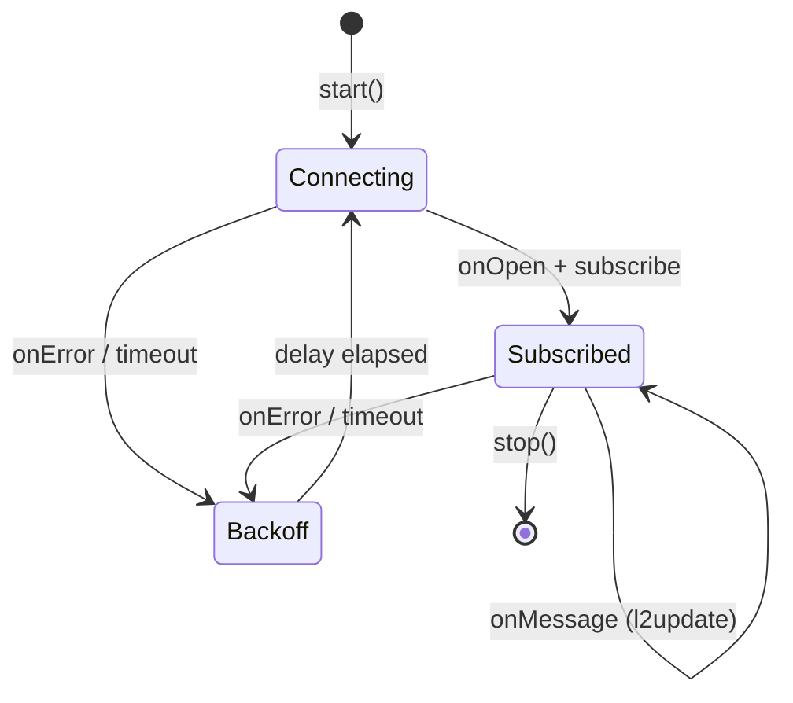

# Architecture

This document describes the system architecture for QuoteWatch, a real-time market microstructure ML system.

## Context & Goals

QuoteWatch predicts short-term price changes (Δ=500ms) using L2 order book data from Coinbase. The system:

- Ingests real-time WebSocket data (L2 order book + trades)
- Extracts features from order book snapshots
- Trains an online ML model from live data
- Persists all data to Iceberg/Parquet (optional)
- Displays predictions via a polling dashboard
- Runs on Google Cloud Run

## 1. System Context

High-level view of system boundaries and external interactions.



## 2. Component Diagram

Internal modules and their responsibilities.

```
src/
├── ingest/
│   ├── websocket_client.py   # Coinbase WS connection, reconnection logic
│   ├── order_book.py         # Thread-safe order book cache (top-10 levels)
│   └── trade_buffer.py       # Thread-safe buffer for recent trades (matches channel)
│
├── features/
│   ├── extractor.py          # Computes spread_bps, imbalance, depth, volatility
│   ├── labeler.py            # Buffers samples, emits labels after Δ=500ms
│   └── stability.py          # Heuristic stability scorer (legacy fallback)
│
├── model/
│   └── classifier.py         # OnlineClassifier: SGDClassifier + StandardScaler
│                              # - partial_fit() for online learning
│                              # - record_prediction() for accuracy tracking
│                              # - Prediction dataclass for labeled predictions
│
├── storage/
│   ├── catalog.py            # Iceberg catalog factory (Postgres-backed)
│   ├── schemas.py            # Table schema definitions (raw_orderbook, raw_trades, etc.)
│   ├── writer.py             # DataWriter: batched persistence to Iceberg
│   │                          # - Dual flush triggers (batch size, time interval)
│   │                          # - Thread-safe with RLock
│   └── reader.py             # DataReader: read historical data for replay
│                              # - Iterator-based access to all 4 tables
│                              # - Returns dataclasses in chronological order
│
├── dashboard/
│   └── app.py                # Plotly Dash app
│                              # - Polls shared state at 300ms
│                              # - Renders prices, charts, model insights
│
└── run_live.py               # Main entry point / orchestrator
                               # - QuoteWatchRunner class
                               # - Wires all components together
```

## 3. Data Flow

Live tick to prediction and dashboard flow.



## 4. ML Pipeline Details

### Label Definition

```
y(t) = 1 if |mid(t + Δ) - mid(t)| > τ
       0 otherwise

Where:
- Δ = 500ms (prediction horizon)
- τ = 0.01% of mid-price (threshold)
```

### Online Learning

The model trains continuously from live data:

1. **Feature vector**: `[spread_bps, imbalance, depth, volatility]`
2. **Scaler**: StandardScaler updated via `partial_fit()`
3. **Classifier**: SGDClassifier with `loss='log_loss'`
4. **Readiness**: Model "ready" after 100 samples of each class

### Accuracy Tracking

Predictions are temporally aligned with labels:
- At time T: make prediction, store with features
- At time T+Δ: label arrives, match with stored prediction
- Calculate rolling accuracy over last 100 predictions

## 5. Deployment

### Cloud Run (Current)



### Environment Variables

- `PORT`: HTTP port (default 8050, Cloud Run sets this)
- `ENABLE_PERSISTENCE`: Set to `true` to enable Iceberg persistence
- `ICEBERG_CATALOG_URI`: Postgres connection string for Iceberg catalog
- `ICEBERG_WAREHOUSE`: Warehouse path (local file:// or gs://)

### Deployment Command

```bash
gcloud run deploy quotewatch \
  --source . \
  --region us-central1 \
  --allow-unauthenticated
```

## 6. Threading Model

The system uses a hybrid async/sync architecture that requires thread-safe shared state.



**Why threading is needed:**
- The WebSocket client runs in an async event loop (asyncio)
- The Dash dashboard runs in a synchronous Flask thread
- Both need to access the same `OrderBook` and `TradeBuffer` instances
- `threading.RLock` ensures safe concurrent access between async writes and sync reads

**Thread-safe components:**
- `OrderBook`: RLock protects bid/ask updates and snapshot reads
- `TradeBuffer`: RLock protects trade buffer modifications and queries
- `DataWriter`: RLock protects write buffers during batched persistence

## 7. State Machine

WebSocket client connection resilience.



## Future Improvements

- WebSocket-based dashboard (replace polling with push)
- Multi-symbol support (ETH-USD, SOL-USD)
- GCS backend for production (Cloud SQL Postgres + GCS warehouse)
- Offline training pipeline (using DataReader for historical replay)
- Model hot-reload
- Kubernetes deployment for horizontal scaling
