# Architecture

This document describes the system architecture for QuoteWatch, a real-time market microstructure ML system.

## Context & Goals

QuoteWatch predicts short-term quote stability (Δ=500ms) using L2 order book data from Coinbase. The system:

- Ingests real-time WebSocket data
- Extracts features at 100ms intervals
- Runs online inference with hot-reloadable models
- Displays predictions via a polling dashboard
- Persists all data to a Parquet lake for offline analysis

## 1. System Context

High-level view of system boundaries and external interactions.

```mermaid
flowchart TB
    subgraph EXT[External]
        U[👤 User]
        CB[Coinbase WebSocket API]
    end

    subgraph SYS[QuoteWatch System]
        ING[WS Ingestor]
        BOOK[Order Book Cache]
        FL[Feature Tick / Labeler]
        INF[Online Inference]
        PUB[Snapshot Publisher]
        UI[Dash UI]
        LAKE[(Parquet Lake<br/>raw / features / labels / predictions)]
        TRN[Offline Trainer]
        REG[Model Registry<br/>artifact store]
    end

    U -->|View live dashboard<br/>HTTP| UI
    CB -->|L2 updates & trades<br/>WS| ING
    ING -->|normalized updates| BOOK
    BOOK -->|top-3 snapshots<br/>100ms| FL
    FL -->|x_t, labels delayed| INF
    INF -->|p_change, metrics| PUB
    PUB -->|latest snapshot<br/>poll 300ms| UI
    FL -->|write features/labels| LAKE
    INF -->|write predictions| LAKE
    LAKE -->|batch training| TRN
    TRN -->|model.pkl + metrics| REG
    REG -->|hot reload model| INF
```

## 2. Component Diagram

Internal boundaries and module responsibilities.

```mermaid
flowchart TB
    subgraph Ingestion
        WSC[WS Client]
        NORM[Normalizer]
        BOOK[Order Book Cache]
    end

    subgraph FeatureLabel[Feature & Label]
        FT[Feature Tick]
        LBL[Labeler Δ=500ms]
        FBUF[Feature Buffer]
    end

    subgraph InferenceService[Inference Service]
        SCL[Scaler]
        CLF[Classifier LR/XGB]
        HRW[Hot Reload Watcher]
        SPUB[Snapshot Publisher<br/>Redis/HTTP]
    end

    subgraph Storage
        LAKE[(Parquet Lake)]
        MREG[Model Registry<br/>MLflow/S3 path]
    end

    subgraph Presentation
        DASH[Dash App]
    end

    WSC --> NORM
    NORM --> BOOK
    BOOK --> FT
    FT --> FBUF
    BOOK --> LBL
    LBL -->|join x_t-Δ ↔ y_t-Δ| FBUF

    FBUF --> SCL
    SCL --> CLF
    CLF --> SPUB
    SPUB --> DASH

    FT --> LAKE
    LBL --> LAKE
    CLF -->|predictions| LAKE
    MREG --> HRW
    HRW --> CLF
```

## 3. Sequence Diagram

Live tick to prediction and dashboard flow.

```mermaid
sequenceDiagram
    title Live Tick → Prediction → Dashboard (Polling)

    participant CB as Coinbase WS
    participant WS as WS Client
    participant BK as Book Cache
    participant FT as Feature Tick
    participant LB as Labeler Δ=500ms
    participant INF as Inference
    participant PUB as Snapshot Publisher
    participant UI as Dash App (poll 300ms)

    CB->>WS: l2update (WS)
    WS->>BK: apply changes
    FT->>BK: read top-3 (every 100ms)
    BK-->>FT: snapshot
    FT->>FT: compute features x(t)
    FT->>LB: enqueue (t, bid, ask)
    LB->>LB: when t is Δ old, emit y(t)
    LB-->>INF: (x(t), y(t)) batch (optional online train)
    FT-->>INF: x(now)
    INF->>INF: scale + predict p(change)
    INF->>PUB: publish {prices, features, p, metrics}
    UI->>PUB: GET /latest (every 300ms)
    PUB-->>UI: JSON snapshot
    UI->>UI: render KPI + sparkline
```

## 4. Deployment Diagram

MVP single-host Docker Compose setup.

**Environment Variables (inference container):**
- `SYMBOLS=BTC-USD`
- `DELTA_MS=500`
- `TICK_MS=100`
- `MODEL_URI=/models/current.pkl`

## 5. Activity Diagram

Offline training and hot reload workflow.

```mermaid
flowchart TD
    A([Start]) --> B[Load /features and /labels Parquet]
    B --> C[Time-based split train/test]
    C --> D[Train baseline LR + XGB d=4]
    D --> E[Evaluate balanced acc, AUC, Brier]
    E --> F{Metrics ≥ threshold?}

    F -->|Yes| G[Package artifact<br/>model.pkl, feature_spec.json, metrics.json]
    G --> H[Upload to Model Registry S3/MLflow]
    H --> I[Emit new version tag qs-0.2.1]
    I --> J[Notify Inference<br/>file watcher / REST ping]
    J --> K[Inference downloads artifact]
    K --> L[Warm-up sanity check<br/>shadow eval optional]
    L --> M[Switch active model]
    M --> N([Stop])

    F -->|No| O[Keep current model<br/>log regression]
    O --> N
```

## 6. State Machine

WebSocket client connection resilience.

## Future Improvements

- WebSocket-based dashboard (replace polling with push)
- Multi-symbol support (ETH-USD, SOL-USD)
- Model registry integration (MLflow)
- Grafana metrics dashboard
- Kubernetes deployment for horizontal scaling
