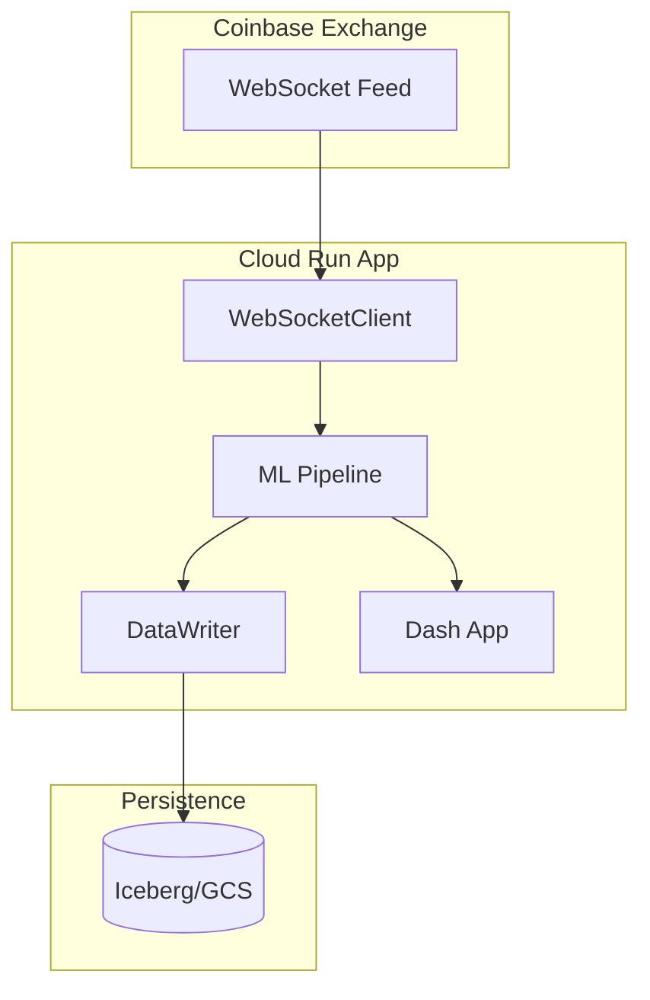
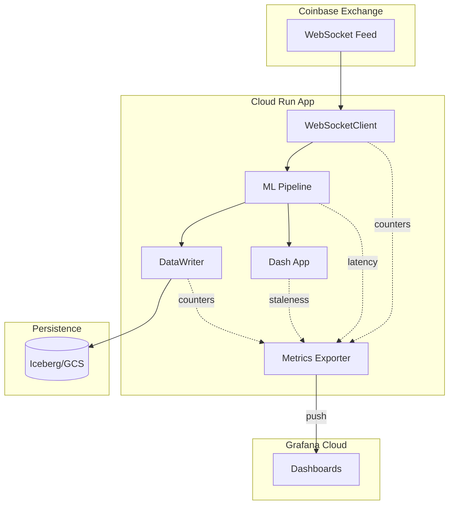

# Production Observability - Design Doc

Epic: [#71](https://github.com/elinsky/market-microstructure-ml/issues/71)

## Overview

Add production observability to verify data capture completeness, diagnose pipeline performance issues, and provide visual dashboards for monitoring system health.

**Primary Goals:**
- Verify we're capturing all market data without gaps
- Diagnose dashboard freezing / pipeline latency issues
- Provide visual dashboards for interviews ("show don't tell")

**Non-Goals:**
- Alerting (design for it, but don't implement in v1)
- Log aggregation (use Cloud Run native logging)
- Distributed tracing (single service, not needed)

---

## 1. Current State



**Problems:**
- No visibility into message rates or data completeness
- No way to detect dropped messages or gaps
- Can't diagnose why dashboard freezes
- No metrics on pipeline latency or buffer depths

---

## 2. Target State



**What's new:**
- Metrics instrumentation throughout the pipeline
- Push-based export to Grafana Cloud
- Two dashboards: Data Pipeline Health + System Performance

---

## 3. Architecture Decisions

| Decision | Choice | Rationale |
|----------|--------|-----------|
| Metrics backend | Grafana Cloud (free tier) | No infra to manage, publicly shareable dashboards, 10k series free |
| Push vs pull | Push (OTLP/Prometheus remote write) | Cloud Run doesn't support scraping |
| Metrics library | `prometheus_client` | Industry standard, simple API |
| Gap detection | Sequence numbers + row count reconciliation | Accurate, not noisy like timestamp-based |
| Dashboards | 2 separate | Data Pipeline (interviews) + System Performance (debugging) |

---

## 4. Metrics Specification

### 4.1 Data Capture Completeness

| Metric | Type | Labels | Description |
|--------|------|--------|-------------|
| `coinbase_messages_received_total` | Counter | `type` (l2update, match, snapshot) | Total messages received from WebSocket |
| `coinbase_match_sequence` | Gauge | - | Last match sequence number (for gap detection) |
| `coinbase_sequence_gaps_total` | Counter | - | Number of detected sequence gaps |
| `iceberg_rows_written_total` | Counter | `table` (raw_orderbook, raw_trades, features, predictions) | Rows written per table |
| `iceberg_flush_total` | Counter | `table` | Number of flush operations |
| `iceberg_flush_duration_seconds` | Histogram | `table` | Time to flush batch to Iceberg |
| `iceberg_flush_rows` | Histogram | `table` | Rows per flush (batch size) |

### 4.2 Pipeline Health

| Metric | Type | Labels | Description |
|--------|------|--------|-------------|
| `pipeline_message_latency_seconds` | Histogram | - | Time from WebSocket message to shared_state update |
| `pipeline_callback_duration_seconds` | Histogram | `stage` (features, labeler, classifier, writer) | Duration of each pipeline stage |
| `labeler_buffer_size` | Gauge | - | Current samples in labeler buffer |
| `labeler_buffer_capacity` | Gauge | - | Max labeler buffer size (1000) |
| `trade_buffer_size` | Gauge | - | Current trades in trade buffer |
| `trade_buffer_capacity` | Gauge | - | Max trade buffer size (1000) |
| `orderbook_updates_per_second` | Gauge | - | Rolling message rate |

### 4.3 ML Performance

| Metric | Type | Labels | Description |
|--------|------|--------|-------------|
| `ml_predict_duration_seconds` | Histogram | - | Time for model.predict() |
| `ml_train_duration_seconds` | Histogram | - | Time for model.partial_fit() |
| `ml_samples_total` | Counter | `label` (0, 1) | Training samples by label |
| `ml_predictions_total` | Counter | `prediction` (0, 1) | Predictions made |

### 4.4 Dashboard Health

| Metric | Type | Labels | Description |
|--------|------|--------|-------------|
| `dashboard_update_age_seconds` | Gauge | - | Time since last shared_state update |
| `dashboard_callback_duration_seconds` | Histogram | - | Time to render dashboard callback |
| `dashboard_callbacks_total` | Counter | - | Number of dashboard update cycles |

---

## 5. Gap Detection Strategy

### 5.1 Sequence Number Tracking

Coinbase `match` messages include a `sequence` field. Track gaps:

```python
class SequenceTracker:
    def __init__(self):
        self._last_sequence: int | None = None
        self._gaps_detected = Counter("coinbase_sequence_gaps_total")

    def check(self, sequence: int) -> None:
        if self._last_sequence is not None:
            expected = self._last_sequence + 1
            if sequence != expected:
                gap_size = sequence - expected
                self._gaps_detected.inc()
                logger.warning(f"Sequence gap: expected {expected}, got {sequence} (gap={gap_size})")
        self._last_sequence = sequence
```

### 5.2 Row Count Reconciliation

Compare messages received vs rows written:

```
Data Completeness = iceberg_rows_written_total / coinbase_messages_received_total
```

Dashboard panel shows this ratio. Should be ~1.0 (allowing for buffer lag).

**Detection logic:**
- If `received - written > buffer_size`, something is being dropped
- Track per-table: orderbook messages → raw_orderbook rows, match messages → raw_trades rows

---

## 6. Dashboard Designs

### 6.1 Data Pipeline Health Dashboard

**Purpose:** "Is my data pipeline reliable?" - for interviews and monitoring.

**Panels:**

| Panel | Visualization | Query |
|-------|---------------|-------|
| Message Rate | Time series | `rate(coinbase_messages_received_total[1m])` |
| Write Rate | Time series | `rate(iceberg_rows_written_total[1m])` by table |
| Data Completeness | Gauge (%) | `iceberg_rows_written_total / coinbase_messages_received_total * 100` |
| Sequence Gaps | Stat | `coinbase_sequence_gaps_total` |
| Messages vs Writes | Time series (overlay) | received vs written counters |
| Flush Latency | Heatmap | `iceberg_flush_duration_seconds` |
| Flush Batch Size | Histogram | `iceberg_flush_rows` |
| Buffer Utilization | Gauge | `labeler_buffer_size / labeler_buffer_capacity * 100` |

**Layout:**
```
┌─────────────────────────────────────────────────────────────┐
│  Message Rate (msg/s)    │  Write Rate (rows/s)            │
├─────────────────────────────────────────────────────────────┤
│  Data Completeness (%)   │  Sequence Gaps  │  Buffer Usage │
├─────────────────────────────────────────────────────────────┤
│  Messages Received vs Rows Written (overlay)                │
├─────────────────────────────────────────────────────────────┤
│  Flush Latency Heatmap   │  Flush Batch Size               │
└─────────────────────────────────────────────────────────────┘
```

### 6.2 System Performance Dashboard

**Purpose:** "Why is stuff slow?" - for debugging freezes and latency.

**Panels:**

| Panel | Visualization | Query |
|-------|---------------|-------|
| Pipeline Latency | Histogram/Heatmap | `pipeline_message_latency_seconds` |
| Stage Breakdown | Stacked time series | `pipeline_callback_duration_seconds` by stage |
| ML Inference Time | Time series | `ml_predict_duration_seconds` p50, p99 |
| ML Training Time | Time series | `ml_train_duration_seconds` p50, p99 |
| Dashboard Staleness | Time series | `dashboard_update_age_seconds` |
| Dashboard Render Time | Time series | `dashboard_callback_duration_seconds` |
| Message Rate vs Latency | Dual-axis | Correlate throughput with latency |

**Layout:**
```
┌─────────────────────────────────────────────────────────────┐
│  Pipeline Latency (p50, p95, p99)                           │
├─────────────────────────────────────────────────────────────┤
│  Stage Duration Breakdown (stacked)                         │
├─────────────────────────────────────────────────────────────┤
│  ML Predict Time         │  ML Train Time                   │
├─────────────────────────────────────────────────────────────┤
│  Dashboard Staleness     │  Dashboard Render Time           │
├─────────────────────────────────────────────────────────────┤
│  Message Rate vs Latency (correlation)                      │
└─────────────────────────────────────────────────────────────┘
```

---

## 7. Implementation Plan

### 7.1 Instrumentation Code

New file: `src/observability/metrics.py`

```python
from prometheus_client import Counter, Gauge, Histogram

# Data capture
messages_received = Counter(
    "coinbase_messages_received_total",
    "Total messages received from Coinbase",
    ["type"]
)
match_sequence = Gauge(
    "coinbase_match_sequence",
    "Last match sequence number"
)
sequence_gaps = Counter(
    "coinbase_sequence_gaps_total",
    "Number of detected sequence gaps"
)
rows_written = Counter(
    "iceberg_rows_written_total",
    "Rows written to Iceberg",
    ["table"]
)
flush_duration = Histogram(
    "iceberg_flush_duration_seconds",
    "Time to flush to Iceberg",
    ["table"]
)

# Pipeline health
pipeline_latency = Histogram(
    "pipeline_message_latency_seconds",
    "End-to-end message processing latency"
)
callback_duration = Histogram(
    "pipeline_callback_duration_seconds",
    "Duration of pipeline stages",
    ["stage"]
)
labeler_buffer = Gauge(
    "labeler_buffer_size",
    "Current labeler buffer size"
)
trade_buffer = Gauge(
    "trade_buffer_size",
    "Current trade buffer size"
)

# ML
predict_duration = Histogram(
    "ml_predict_duration_seconds",
    "ML prediction duration"
)
train_duration = Histogram(
    "ml_train_duration_seconds",
    "ML training duration"
)

# Dashboard
dashboard_staleness = Gauge(
    "dashboard_update_age_seconds",
    "Seconds since last shared_state update"
)
dashboard_render = Histogram(
    "dashboard_callback_duration_seconds",
    "Dashboard callback duration"
)
```

### 7.2 Push to Grafana Cloud

Using `prometheus_client` with push gateway or OTLP exporter:

```python
# Option 1: Prometheus remote write (via prometheus-client + requests)
# Option 2: OpenTelemetry OTLP export

# We'll use prometheus_client with a background push thread
from prometheus_client import push_to_gateway, REGISTRY

def push_metrics():
    """Push metrics to Grafana Cloud."""
    push_to_gateway(
        gateway=os.environ["GRAFANA_PUSH_URL"],
        job="quotewatch",
        registry=REGISTRY,
        handler=lambda url, method, timeout, headers, data: requests.post(
            url,
            data=data,
            headers={**headers, "Authorization": f"Bearer {os.environ['GRAFANA_API_KEY']}"},
            timeout=timeout,
        )
    )
```

### 7.3 Local Development

Same metrics, same Grafana Cloud destination. Differentiate with labels:

```python
environment = os.environ.get("ENVIRONMENT", "local")
# Add as label to all metrics or use separate job name
```

---

## 8. Grafana Cloud Setup

### 8.1 Account Setup

1. Create free Grafana Cloud account at grafana.com
2. Note the stack URL (e.g., `https://your-stack.grafana.net`)
3. Create API key with `MetricsPublisher` role
4. Get Prometheus remote write endpoint

### 8.2 Environment Variables

```bash
# Local (.env)
GRAFANA_PUSH_URL=https://prometheus-prod-xx.grafana.net/api/prom/push
GRAFANA_API_KEY=glc_xxx...
ENVIRONMENT=local

# Production (Cloud Run secrets)
GRAFANA_PUSH_URL=https://prometheus-prod-xx.grafana.net/api/prom/push
GRAFANA_API_KEY=<from Secret Manager>
ENVIRONMENT=production
```

### 8.3 Dashboard Provisioning

Export dashboard JSON and store in repo:
- `dashboards/data-pipeline-health.json`
- `dashboards/system-performance.json`

Can be imported manually or via Grafana API.

---

## 9. Implementation Order

1. **Grafana Cloud setup** - Create account, get credentials, test push
2. **Metrics module** - Create `src/observability/metrics.py` with all metrics defined
3. **Push infrastructure** - Background thread to push metrics periodically
4. **Instrument WebSocket client** - Message counters, sequence tracking
5. **Instrument DataWriter** - Row counters, flush metrics
6. **Instrument pipeline** - Latency, stage durations, buffer gauges
7. **Instrument dashboard** - Staleness, render time
8. **Create dashboards** - Data Pipeline Health, System Performance
9. **Local testing** - Verify metrics flow in local dev
10. **Deploy to prod** - Add secrets, verify in production
11. **Documentation** - Update deployment docs, add runbook

---

## 10. Files to Create/Modify

| File | Action | Description |
|------|--------|-------------|
| `src/observability/__init__.py` | Create | Package init |
| `src/observability/metrics.py` | Create | Metric definitions |
| `src/observability/push.py` | Create | Grafana Cloud push logic |
| `src/observability/sequence.py` | Create | Sequence gap tracker |
| `src/ingest/websocket_client.py` | Modify | Add message counters |
| `src/storage/writer.py` | Modify | Add write/flush metrics |
| `src/run_live.py` | Modify | Add pipeline latency instrumentation |
| `src/features/labeler.py` | Modify | Expose buffer size metric |
| `src/features/extractor.py` | Modify | Add timing metrics |
| `src/model/classifier.py` | Modify | Add predict/train timing |
| `src/dashboard/app.py` | Modify | Add staleness and render metrics |
| `dashboards/` | Create | Dashboard JSON exports |
| `tests/observability/` | Create | Metric tests |

---

## 11. Open Questions

1. ~~Metrics backend?~~ **Resolved:** Grafana Cloud free tier
2. ~~Gap detection strategy?~~ **Resolved:** Sequence numbers + row count reconciliation
3. ~~Dashboard organization?~~ **Resolved:** 2 dashboards (Data Pipeline, System Performance)
4. **Push frequency?** Every 15 seconds? 30 seconds? (tradeoff: freshness vs API calls)
5. **Metric cardinality?** Keep labels minimal to stay within free tier limits

---

## 12. Success Criteria

- [ ] Can verify data capture completeness via dashboard
- [ ] Can detect sequence gaps in real-time
- [ ] Can see pipeline latency breakdown by stage
- [ ] Can diagnose dashboard freeze causes
- [ ] Dashboards are publicly accessible for interviews
- [ ] Works in both local dev and production