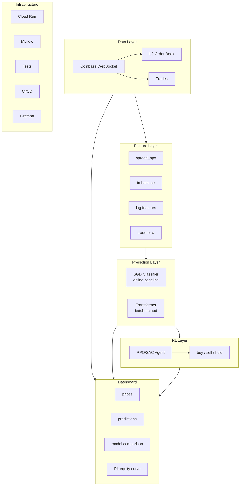

# QuoteWatch - Product Requirements

## What is this?

This doc describes where I want QuoteWatch to end up. It's a portfolio project to help me land a quant role (ML Engineer, Quant Dev, Quant Researcher, etc).

The point isn't to build a real trading system. It's to have something concrete to talk about in interviews that shows I can actually do the job.

---

## Skills I Want to Demonstrate

This is the checklist. The project should hit all of these:

| Skill | What it means |
|-------|---------------|
| Real-time systems | Streaming data, async, low-latency thinking |
| Feature engineering | Building useful features from raw data |
| Classical ML | Trees, linear models, online learning |
| Deep learning | Neural nets, PyTorch, Transformers |
| Reinforcement learning | Sequential decisions, policy optimization |
| Backtesting | Testing on historical data without cheating |
| MLOps / Deployment | Model versioning, retraining, cloud deploy |
| Software engineering | Clean code, tests, docs, CI/CD |
| Math rigor | Right metrics, statistical thinking |
| Domain knowledge | Market microstructure, how trading works |

---

## The Big Picture

QuoteWatch is a system that:

1. Pulls live order book data from Coinbase
2. Computes features and predicts price movements (classical ML + Transformer)
3. Has an RL agent that learns to trade based on those predictions
4. Shows everything on a live dashboard

Basically: **streaming data -> features -> predictions -> trading decisions -> dashboard**

---

## Current Status

- Coinbase WebSocket for L2 order book (keeping top 10 levels) + trades (matches channel)
- 4 basic features: spread_bps, imbalance, depth, volatility
- SGDClassifier that trains online
- Optional persistence to Iceberg/Parquet (raw data, features, predictions)
- Dash dashboard that polls every 300ms
- Running on Google Cloud Run
- Simple rolling accuracy tracking

---

## Target

### Data

| Want | Why | Epic | Status |
|------|-----|------|--------|
| More depth (10-20 levels, not 3) | Better features, more signal | [#35](https://github.com/elinsky/market-microstructure-ml/issues/35) | done |
| Trade data (matches channel) | Trade flow imbalance, aggressor detection | [#35](https://github.com/elinsky/market-microstructure-ml/issues/35) | done |
| Save data to disk (Parquet or DB) | Backtesting, retraining | [#35](https://github.com/elinsky/market-microstructure-ml/issues/35) | done |
| Replay historical data | Test models on past data | [#35](https://github.com/elinsky/market-microstructure-ml/issues/35) | done |
| Multi-symbol (BTC + ETH) | Shows it's not hardcoded | - | - |

### Observability

| Want | Why | Epic | Status |
|------|-----|------|--------|
| Verify data capture completeness | Ensure no gaps before model training | [#71](https://github.com/elinsky/market-microstructure-ml/issues/71) | - |
| Detect sequence gaps | Catch dropped messages in real-time | [#71](https://github.com/elinsky/market-microstructure-ml/issues/71) | - |
| Pipeline latency metrics | Diagnose dashboard freezes | [#71](https://github.com/elinsky/market-microstructure-ml/issues/71) | - |
| Buffer utilization tracking | Detect backpressure issues | [#71](https://github.com/elinsky/market-microstructure-ml/issues/71) | - |
| Grafana dashboards | Visual monitoring, interview talking point | [#71](https://github.com/elinsky/market-microstructure-ml/issues/71) | - |

### Features

| Want | Why | Epic | Status |
|------|-----|------|--------|
| Keep current 4 | They work | - | done |
| Trade flow features (trade_imbalance, OFI) | Volume imbalance tells you something | [#56](https://github.com/elinsky/market-microstructure-ml/issues/56) | - |
| Microprice | Better fair value than mid price | [#56](https://github.com/elinsky/market-microstructure-ml/issues/56) | - |
| Book pressure (multi-level imbalance) | Deeper LOB signal | [#56](https://github.com/elinsky/market-microstructure-ml/issues/56) | - |
| Realized volatility | Regime detection | [#56](https://github.com/elinsky/market-microstructure-ml/issues/56) | - |
| Add lag features (t-1, t-5, t-10) | Temporal patterns | - | - |
| Raw LOB as tensor | Feed to Transformer directly | - | - |

### Prediction Models

| Want | Why | Epic | Status |
|------|-----|------|--------|
| Keep SGD as baseline | Simple, online, something to compare against | - | done |
| Add Transformer | Deep learning checkbox, modern architecture | - | - |
| Multiple horizons (100ms, 500ms, 1s) | More interesting prediction task | - | - |
| Model registry (MLflow or whatever) | Version models, track experiments | - | - |
| Batch retraining pipeline | Not just online learning | - | - |

### RL Agent

| Want | Why | Epic | Status |
|------|-----|------|--------|
| Market simulator | Replay data, simulate fills | - | - |
| Realistic costs | Slippage, fees, market impact | - | - |
| State = market features + predictions + position | Everything the agent needs | - | - |
| Actions = buy/sell/hold | Start simple | - | - |
| Reward = PnL - costs - inventory penalty | Standard setup | - | - |
| PPO or SAC | Modern, stable algorithms | - | - |
| Benchmark against TWAP, buy-and-hold | Need something to compare to | - | - |

### Evaluation

| Want | Why | Epic | Status |
|------|-----|------|--------|
| Walk-forward backtesting | Proper out-of-sample testing | - | - |
| Prediction metrics: AUC, Brier, calibration | Not just accuracy | - | - |
| Trading metrics: Sharpe, drawdown | Standard quant metrics | - | - |
| Feature importance (SHAP) | Explain what's driving predictions | - | - |

### Dashboard

| Want | Why | Epic | Status |
|------|-----|------|--------|
| Keep current views | They're fine | - | done |
| Add model comparison (SGD vs Transformer) | Show the difference | - | - |
| Add RL view (equity curve, position, actions) | See the agent work | - | - |
| Backtest results | Show historical performance | - | - |

### Infrastructure

| Want | Why | Epic | Status |
|------|-----|------|--------|
| Keep Cloud Run | It works | - | done |
| Add model registry | Track versions | - | - |
| Add retraining job | Keep model fresh | - | - |
| More tests | Confidence in changes | [#35](https://github.com/elinsky/market-microstructure-ml/issues/35) | done |

---

## Diagram

---

## Features

Prediction stuff:

- See live predictions updating in real-time
- See which features matter most
- Compare SGD vs Transformer side-by-side
- Backtest models on historical data
- Retrain models when needed

RL stuff:

- Train an agent on historical data
- See the agent's equity curve and actions
- Compare agent vs baselines (TWAP, buy-and-hold)
- Try different RL algorithms

General:
- Code is clean enough that an interviewer would be impressed

---

## Skills Checklist

| Skill | How |
|-------|-----|
| Real-time systems | WebSocket streaming, async, live updates |
| Feature engineering | LOB features, lag features, trade flow |
| Classical ML | SGD baseline |
| Deep learning | Transformer on LOB sequences |
| RL | PPO/SAC trading agent |
| Backtesting | Walk-forward validation |
| MLOps | Cloud Run, MLflow, retraining pipeline, Grafana observability |
| Software engineering | Tests, docs, clean code |
| Math rigor | Proper metrics, statistical tests |
| Domain knowledge | Microstructure, order flow, trading costs |

---

## References

**Market Microstructure:**
- Bouchaud et al. (2018) "Trades, Quotes and Prices: Financial Markets Under the Microscope" - primary reference for feature ideas and market mechanics